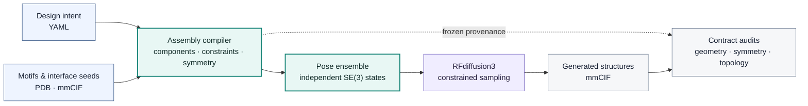

<h1 align="center">RFD3-Mosaic</h1>

<p align="center">
  <strong>Constraint-compiled design of symmetric protein assemblies with RFdiffusion3</strong>
</p>

<p align="center">
  <a href="docs/rfd3_mosaic/PROJECT_STATUS.md"></a>
  <a href="pyproject.toml"></a>
  <a href="LICENSE.md"></a>
  <a href="models/rfd3/README.md"></a>
</p>

<p align="center">
  <a href="#overview">Overview</a> ·
  <a href="#design-workflows">Workflows</a> ·
  <a href="#quick-start">Quick start</a> ·
  <a href="#documentation">Documentation</a> ·
  <a href="docs/rfd3_mosaic/PROJECT_STATUS.md">Project status</a>
</p>

> **Status — benchmark phase.** Engineering contracts are covered by
> automated compiler, runtime and audit tests. Scientific performance is now
> being quantified across larger backbone cohorts.

## Overview

RFD3-Mosaic extends Foundry/RFdiffusion3 with an explicit representation of
symmetric assemblies. A user declares the intended symmetry, structural
components, fixed motifs or supplied interfaces, and generated polymer
connections. Mosaic then compiles that declaration into replayable RFD3
inputs, executes constrained sampling, and audits the resulting structures.



The software does not infer a supposedly optimal cage architecture from an
arbitrary structure. Users define the scientific design problem; Mosaic makes
that problem executable, reproducible and auditable.

## Core capabilities

| Domain | Capability |
| --- | --- |
| Geometry | Exact fixed-motif and complete supplied-interface preservation |
| Symmetry | Exact Cn/Dn execution; T/O/I paths for controlled research evaluation |
| Components | Locked, bounded-mobile and jointly rigid component semantics |
| Assembly | Multiple components, motif orbits, interface identities and polymer connections |
| Sampling | Independent, reproducible assembly poses and diffusion seeds per design |
| Guidance | Optional generated-interface packing and scaffold-core objectives |
| Reproducibility | Deterministic RFD3 lowering, frozen configuration and source provenance |
| Quality control | Geometry, symmetry, interface, clash, continuity and cross-chain topology audits |
| Execution | Identical compiler, worker and audit path for direct and Slurm-backed runs |

Sequence design, independent refolding and experimental validation are planned
downstream stages of the Mosaic workflow. They are not yet integrated in the
current development branch.

## Design workflows

RFD3-Mosaic supports two complementary starting points.

| Workflow | User supplies | Mosaic preserves | Mosaic generates |
| --- | --- | --- | --- |
| Supplied interface | A complete interface seed | Internal seed geometry | Connecting scaffold under the declared symmetry |
| Central motif | A fixed structural motif | Motif geometry | Scaffold and a symmetry-related interface |

A complete supplied interface can move as one joint-rigid body when the design
allows it; its two sides are never rearranged independently. A central motif
can instead be locked or assigned bounded translation and rotation while
packing guidance acts on the generated regions.

## Installation

Python 3.12 and an RFD3-compatible PyTorch installation are required. Install
PyTorch for the target CPU or CUDA environment first, then install the current
development branch:

```bash
python -m venv .venv
source .venv/bin/activate
python -m pip install --upgrade pip
python -m pip install \
  "rfd3-mosaic[rfd3] @ git+https://github.com/Khmelinskaia-Lab/foundry.git@hx/rfd3-mosaic-product-core"
```

RFD3 model weights are not distributed with this repository. Place an
authorized `rfd3_latest.ckpt` in `~/.foundry/checkpoints/`, or provide its
location in an execution profile.

Check the installation without launching inference:

```bash
rfd3-mosaic doctor --profile local
rfd3-mosaic capabilities
```

For editable installations, checkpoint configuration and cluster profiles,
see the [installation guide](docs/rfd3_mosaic/INSTALLATION.md).

## Quick start

Create a design that preserves a complete two-sided interface seed:

```bash
rfd3-mosaic init design.yaml \
  --task supplied-interface \
  --input interface-seed.pdb \
  --side-a A165-194 \
  --side-b B211-241 \
  --symmetry C3 \
  --designs 100
```

Or create a design in which a fixed central motif is surrounded by a newly
generated symmetric interface:

```bash
rfd3-mosaic init design.yaml \
  --task central-motif \
  --input motif.pdb \
  --motif-selector A12-20 \
  --symmetry C3 \
  --designs 100
```

Review the resolved design before using GPU time:

```bash
rfd3-mosaic plan design.yaml
rfd3-mosaic validate design.yaml
rfd3-mosaic run design.yaml
```

For `designs: N`, movable-assembly workflows instantiate independent,
reproducible assembly poses and diffusion seeds for the requested designs.
Fully locked arrangements retain their declared pose. RFD3 multi-example
execution reuses a model load while preserving per-design inputs.

See the [quick-start guide](docs/rfd3_mosaic/QUICKSTART.md) for component
motion, portable examples, Slurm profiles and result inspection.

## Results and interpretation

Each run records three separate outcomes:

1. **Generation:** whether inference produced a finite coordinate file.
2. **Contract checks:** whether declared invariants such as fixed geometry,
   symmetry and backbone continuity were met.
3. **Advisory measurements:** task-dependent structural descriptors intended
   to support ranking and review.

Generated structures are retained even when a contract is flagged. Advisory
measurements are not presented as universal designability thresholds and do
not replace sequence design, refolding or experimental assessment.

Useful commands after a run are:

```bash
rfd3-mosaic status RUN_ID_OR_DIRECTORY
rfd3-mosaic report RUN_ID_OR_DIRECTORY
rfd3-mosaic audit RUN_ID_OR_DIRECTORY
```

Campaign outputs also include a structure-only ZIP of plain CIF files for
batch review.

## Documentation

- [Documentation index](docs/rfd3_mosaic/README.md)
- [Installation and execution environments](docs/rfd3_mosaic/INSTALLATION.md)
- [Quick start](docs/rfd3_mosaic/QUICKSTART.md)
- [Command-line reference](docs/rfd3_mosaic/USER_CLI.md)
- [Capability boundary](DEVELOPMENT_STATUS.md)
- [Current project status](docs/rfd3_mosaic/PROJECT_STATUS.md)
- [Packing guidance](docs/rfd3_mosaic/PACKING_GUIDANCE.md)
- [Metric provenance](docs/rfd3_mosaic/STRUCTURE_METRIC_PROVENANCE.md)
- [Backbone-evaluation evidence](docs/rfd3_mosaic/BACKBONE_EVALUATION_EVIDENCE.md)

Historical implementation notes, root-cause analyses and site-specific
validation records are retained under `docs/internal/` as development
provenance. They are not user instructions.

## Development and validation

```bash
git clone --branch hx/rfd3-mosaic-product-core \
  https://github.com/Khmelinskaia-Lab/foundry.git rfd3-mosaic
cd rfd3-mosaic
python -m pip install -e ".[rfd3,dev]"
make local-test
make mosaic-release-smoke
```

Changes should preserve validated workflows, include focused regression tests
and distinguish CPU evidence from GPU evidence. See
[CONTRIBUTING.md](CONTRIBUTING.md).

## Upstream software and citation

RFD3-Mosaic is an independent research extension of the open-source
[Foundry](https://github.com/RosettaCommons/foundry) and RFdiffusion3 stack; it
is not an official Rosetta Commons or Institute for Protein Design release.
The upstream model documentation is retained in
[models/rfd3/README.md](models/rfd3/README.md).

Until a dedicated RFD3-Mosaic publication is available, users should cite the
relevant RFdiffusion3, Foundry, AtomWorks and model publications associated
with the components used in their workflow.

## License

RFD3-Mosaic retains the upstream BSD 3-Clause license. See
[LICENSE.md](LICENSE.md).
