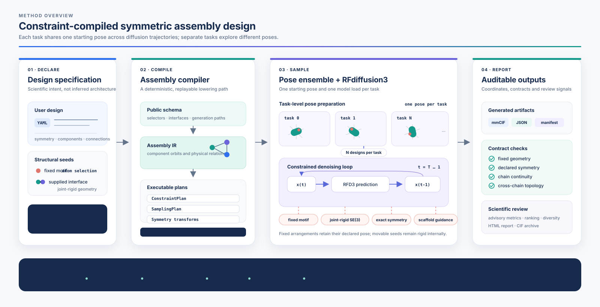

<h1 align="center">RFD3-Mosaic</h1>

<p align="center">
  <strong>Constraint-compiled symmetric protein assembly design with RFdiffusion3</strong>
</p>

<p align="center">
  <a href="docs/rfd3_mosaic/PROJECT_STATUS.md"></a>
  <a href="pyproject.toml"></a>
  <a href="LICENSE.md"></a>
  <a href="models/rfd3/README.md"></a>
</p>

<p align="center">
  <a href="#getting-started">Getting started</a> ·
  <a href="#design-workflows">Design workflows</a> ·
  <a href="#how-mosaic-works">Architecture</a> ·
  <a href="#outputs-and-interpretation">Outputs</a> ·
  <a href="docs/rfd3_mosaic/README.md">Documentation</a>
</p>

RFD3-Mosaic is a research software layer for designing symmetric protein
assemblies with [RFdiffusion3](models/rfd3/README.md). It converts an explicit
assembly specification—symmetry, components, fixed motifs, supplied
interfaces and polymer connections—into reproducible RFD3 inputs, executes
constrained backbone generation and audits the resulting structures against
the declared geometry.

Mosaic is intended for problems in which the scientist knows the assembly to
design. It does not guess a supposedly optimal cage architecture from an
arbitrary structure.

> [!IMPORTANT]
> RFD3-Mosaic is an actively developed research preview. The Cn/Dn release
> paths have extensive CPU coverage and representative GPU evidence. T/O/I,
> quotient and advanced multi-interface paths remain controlled research
> capabilities. See the [current project status](docs/rfd3_mosaic/PROJECT_STATUS.md)
> before using experimental paths in a production campaign.

## Getting started

### Requirements

- Python 3.12;
- a PyTorch installation compatible with the target CPU or CUDA runtime;
- an authorized RFdiffusion3 checkpoint;
- a GPU suitable for RFdiffusion3 inference when generating structures.

RFD3-Mosaic is not tied to a particular server, scheduler or GPU model.
Resource requirements depend on the assembly size and symmetry multiplicity.

### Install

Install PyTorch for the target environment first, then install the current
development branch:

```bash
python -m venv .venv
source .venv/bin/activate
python -m pip install --upgrade pip
python -m pip install \
  "rfd3-mosaic[rfd3] @ git+https://github.com/Khmelinskaia-Lab/foundry.git@hx/rfd3-mosaic-product-core"
```

RFD3 model weights are not redistributed by this repository. Place an
authorized `rfd3_latest.ckpt` in `~/.foundry/checkpoints/`, or configure its
location in an execution profile.

Verify the installation without launching inference:

```bash
rfd3-mosaic doctor --profile local
rfd3-mosaic capabilities
```

See the [installation guide](docs/rfd3_mosaic/INSTALLATION.md) for editable
installs, checkpoints and portable Slurm profiles.

### Run a first design

Create a design that preserves a complete two-sided interface seed:

```bash
rfd3-mosaic init design.yaml \
  --task supplied-interface \
  --input interface-seed.pdb \
  --side-a A165-194 \
  --side-b B211-241 \
  --symmetry C3 \
  --designs 100
```

Inspect the resolved plan and validate the compiled input before using GPU
time, then run it:

```bash
rfd3-mosaic plan design.yaml
rfd3-mosaic validate design.yaml
rfd3-mosaic run design.yaml
```

Inspect the completed run by job ID or directory:

```bash
rfd3-mosaic status RUN_ID_OR_DIRECTORY
rfd3-mosaic report RUN_ID_OR_DIRECTORY
```

The [quick-start guide](docs/rfd3_mosaic/QUICKSTART.md) covers portable
examples, component motion, execution profiles and result inspection.

## Design workflows

Mosaic exposes two distinct backbone-generation problems rather than hiding
them behind one packing mode.

### Preserve a supplied interface

Use this workflow when the input already contains the interface geometry that
must remain unchanged. Mosaic treats both sides as one joint-rigid object:
their internal geometry is exact, while the complete object may translate and
rotate relative to the symmetry frame when the design permits motion.

```bash
rfd3-mosaic init design.yaml \
  --task supplied-interface \
  --input interface-seed.pdb \
  --side-a A165-194 \
  --side-b B211-241 \
  --symmetry C3
```

### Generate an interface around a motif

Use this workflow when the input supplies a fixed structural motif and the
surrounding scaffold and symmetry-related interface must be generated.

```bash
rfd3-mosaic init design.yaml \
  --task central-motif \
  --input motif.pdb \
  --motif-selector A12-20 \
  --symmetry C3 \
  --component-motion guided
```

Generated-interface guidance and supplied-interface preservation have
different semantics. The former can guide new cross-component packing; the
latter does not ask generated residues to create a second interface unless
the user explicitly declares one.

### Fixed and movable geometry

Mosaic separates three levels that are often conflated in diffusion inputs:

- **fixed atoms** retain their declared coordinates;
- **joint-rigid components** preserve internal geometry while moving as a
  single SE(3) body;
- **generated polymer** is sampled by RFD3 under the compiled constraints.

For movable-assembly workflows, `designs: N` instantiates independent,
reproducible assembly poses and diffusion seeds. Fully locked arrangements
retain the declared pose. Multi-example execution lets RFD3 reuse one model
load without collapsing those per-design inputs into repeated diffusion from
one pose.

Bounded-mobile rigid components use a step-count-independent capture/settle/
polish schedule over 40%/40%/20% of their declared active window. Early
sampling can use the full per-step SE(3) trust region, while later proposals
become progressively smaller. Fixed coordinates and the internal geometry of
joint-rigid seeds are unaffected.

## How Mosaic works

<p align="center">
  
</p>

The compiler resolves named components, motif and interface orbits, polymer
paths, symmetry transforms and motion policies before inference. Every
executable design is lowered to an explicit RFD3 specification with frozen
configuration, seeds and software provenance. Sampling then applies the
compiled fixed-geometry, symmetry, mobility and optional guidance contracts.

This division of responsibility is deliberate:

| Layer | Responsibility |
| --- | --- |
| User specification | Declares the intended assembly and scientific constraints |
| Mosaic compiler | Resolves topology, symmetry, geometry, polymer paths and per-design poses |
| RFdiffusion3 | Generates conditioned protein backbones |
| Mosaic runtime | Enforces compiled constraints and records guidance behavior |
| Mosaic audits | Measures declared contracts and advisory structural properties |

## Outputs and interpretation

Each run preserves the resolved configuration, compiled input, generated
coordinates, runtime provenance and audit reports. Completed structures are
mirrored incrementally into `generated_structures_cif/` as plain CIF files;
the completed run also provides a structure-only ZIP for batch inspection.

Mosaic reports three different outcomes:

1. **Generated** — inference produced a finite coordinate structure.
2. **Contract checks** — declared invariants such as fixed geometry, symmetry,
   continuity and topology were measured.
3. **Advisory measurements** — task-dependent descriptors support ranking and
   scientific review.

A generated structure is retained when a contract or advisory check is
flagged. Advisory metrics are not presented as universal designability
thresholds and do not replace sequence design, independent refolding or
experimental assessment.

Useful post-run commands are:

```bash
rfd3-mosaic status RUN_ID_OR_DIRECTORY
rfd3-mosaic report RUN_ID_OR_DIRECTORY
rfd3-mosaic audit RUN_ID_OR_DIRECTORY
```

## Capability boundary

| Area | Current maturity |
| --- | --- |
| Cn/Dn symmetry, fixed motifs and supplied interfaces | Supported release target |
| Locked, bounded-mobile and joint-rigid components | Supported release target |
| Multiple components, motif orbits and polymer connections | Supported release target |
| Independent per-design assembly poses | Supported release target |
| Generated-interface guidance | Implemented; scientific calibration continues |
| T/O/I finite-group execution | Research capability with path-specific GPU evidence |
| Stabilizers, cosets, quotient orbits and advanced multi-interface cases | Controlled research capability |

The software fails closed when it cannot produce an unambiguous executable
lowering. It does not silently invent symmetry, connectivity, interface
multiplicity or a preferred architecture.

Sequence design, independent refolding and experimental validation are
planned downstream stages of the Mosaic workflow. They are not yet integrated
in the current development branch.

## Documentation

- [Documentation index](docs/rfd3_mosaic/README.md)
- [Installation and execution](docs/rfd3_mosaic/INSTALLATION.md)
- [Quick start](docs/rfd3_mosaic/QUICKSTART.md)
- [CLI reference](docs/rfd3_mosaic/USER_CLI.md)
- [Project status and GPU evidence](docs/rfd3_mosaic/PROJECT_STATUS.md)
- [Public capability boundary](DEVELOPMENT_STATUS.md)
- [Packing-guidance semantics](docs/rfd3_mosaic/PACKING_GUIDANCE.md)
- [Metric provenance](docs/rfd3_mosaic/STRUCTURE_METRIC_PROVENANCE.md)
- [Backbone-evaluation evidence](docs/rfd3_mosaic/BACKBONE_EVALUATION_EVIDENCE.md)

Chronological investigations, site-specific validation and implementation
history are retained under `docs/internal/` as development provenance. They
are not user instructions.

## Development

```bash
git clone --branch hx/rfd3-mosaic-product-core \
  https://github.com/Khmelinskaia-Lab/foundry.git rfd3-mosaic
cd rfd3-mosaic
python -m pip install -e ".[rfd3,dev]"
make local-test
make mosaic-release-smoke
```

Contributions should preserve validated workflows, add focused regression
tests and distinguish CPU evidence from GPU evidence. See
[CONTRIBUTING.md](CONTRIBUTING.md).

## Upstream software and citation

RFD3-Mosaic is a research extension of the open-source
[Foundry](https://github.com/RosettaCommons/foundry) and RFdiffusion3 stack. It
is not an official Rosetta Commons or Institute for Protein Design release.

Until a dedicated RFD3-Mosaic publication is available, cite the relevant
RFdiffusion3, Foundry, AtomWorks and model publications used in the workflow.
The upstream model documentation is retained in
[models/rfd3/README.md](models/rfd3/README.md).

## License

RFD3-Mosaic retains the upstream BSD 3-Clause license. See
[LICENSE.md](LICENSE.md).
