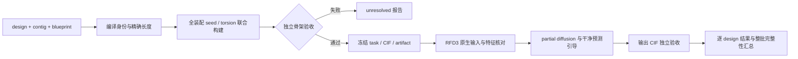

# 完整工作流检查记录（2026-09-21）

本轮修复覆盖公开任务输入、完整骨架构建、原生 RFD3 生成区交接、采样控制、输出审计和批次状态。
结论是这些环节已有可执行的检查与拒绝路径；不代表学习模型的稳定生成率已经验证。

| 环节 | 本轮修复或核对 | 失败如何处理 |
|---|---|---|
| 长度、连接与固定身份 | 以实际编译 contig 为准，模板和目标不同长度用显式 H/L 地标映射 | 缺映射或重新编译改变长度即拒绝 |
| pose 与生成区 | 整个 joint seed 的刚体变量和全部生成区扭转角共同优化，包含完整对称装配碰撞 | 有限 CPU 预算找不到合格见证则 unresolved |
| 螺旋支撑 | 每条声明支撑边独立达标；真实生成 alpha 螺旋不得漏声明、不得把同一长螺旋拆开冒充伙伴 | 参考和最终输出分别拒绝 |
| 生成骨架 | 实际 N/CA/C/O 键长、键角、肽平面及非局部骨架碰撞为必需验收 | CA 合格不能掩盖其余骨架损坏 |
| 空间穿插 | 有限 CA 线段距离和参考变形净空证书 | 不能提供证书或实际距离不足则不合格；不作全噪声轨迹/自结证明 |
| 输入交接 | 原生 partial 输入、实际原子身份、固定坐标/序列掩码及群帧逐项核对 | 缺失/重复/错误掩码/错误群对应即拒绝 |
| 刚体移动 | seed、参考、生成区候选和 controller/patch 状态共同准备、共同提交 | 任一检查失败则整步回退 |
| 移动投影 | 提案投影使用新提案条件，修复读取旧固定坐标而把 seed 拉回的问题 | 正式条件只在通过后更新 |
| sampler 出口 | 独立重测最终 N/CA/C/O，保存明确的 contract_met | 原始失败结构可保存作诊断，不算合格 |
| 输出审计 | 从 CIF 重测；移动模式重放历史并核对所有固定原子 | 缺移动记录、固定原子不符、任何必需审计失败都不通过 |
| 写盘 | 准备目录完整写好后 rename；逐 design 结构先发布、元数据最后发布 | 不暴露半写的可运行准备目录，不覆盖已有任务 |
| 批次异常 | 每个 design 隔离；普通异常继续，连续三次或致命异常停止 | 保存 generated / failed / not_run，保留已有输出的审计 |
| 汇总与后处理 | 验证冻结预期身份、数量、当前元数据和结构是否存在；不沿用缺失报告的旧通过状态 | 部分结果保持 partial；重审不能补出尚未生成的设计 |

公式、系数、来源及触发条件集中在 [DECISION_RULES 第 25 节](DECISION_RULES.zh-CN.md#25-完整骨架的联合构建partial-diffusion-与-v2-验收)，
入口见 [完整骨架使用说明](COMPLETE_SCAFFOLD.zh-CN.md)。

## 验证证据

- 全套 `tests/rfd3_mosaic/unit`：1201 passed，197 subtests passed；CPU，Python 3.14，未加载学习模型权重。
- 随后补充当前结果文件完整性及旧氢键统计修复，相关定向回归：61 passed。
- 联合构建 Jacobian 经数值差分核对，覆盖 C2/D2；优化器成功但装配验收失败的例子必须拒绝。
- 最后对公开构建、真实 controller 状态隔离和移动 sampler 的定向检查：17 passed。
- 原生 sampler 用确定性替代 denoiser 测试接受、回退、后续 conditioning 与最终独立验收；这验证控制流程，不能替代真实模型结果。
- 公开移动任务经过 prepare、重新编译、原生 input builder 与最终 feature aggregator 的身份/掩码检查。
- 实际 C3/PI25 参考的联合 CPU 构建得到通过见证：每链 61 个 seed 残基加 90 个生成残基，总长 151。闭合最大误差约 0.000290 Å；参考地标最大偏差约 1.409 Å，低于该任务声明的 2 Å；全装配骨架碰撞检查通过。原生预检报告三条链各 151 个残基。
- `git diff --check` 通过；新增核心模块 Ruff 通过；全项目关键错误检查排除了既有 jaxtyping 字符串注解误报后通过。全项目所有样式规则尚非零告警，不能称全部 lint 已清空。

本地原始证据保存于工作区 `rfd3-mosaic-review/scaffold-workflow-2026-09-20/`，包含
`prepared-c3-v2-joint/preparation_report.json`、`native-v2-review-20260921/rfd3_prevalidation.json`、
`mosaic-final-unit-20260921.log` 和 `mosaic-final-targeted-20260921.log`。
测试环境与本地参考文件不作为发行包依赖，也不在文档中冒称远程 GPU 验证。

## 仍有明确边界

完整骨架模式需要显式参考；普通 de novo 模式不能因新增入口就获得参考限定的螺旋排布保证。
有限优化不保证任意长度均有解，不能保证每个 Cn/Dn 组合均有高成功率。已实现的 alpha 支撑
不等于真正 coiled-coil、侧链疏水核心、序列可设计性或实验稳定性。
本轮没有新增 GPU 作业；发布前仍需用固定版本、固定任务和不变验收标准证明真实模型生成质量。
这一步是验证，不应通过反复放宽门槛来改变成功定义。

### 2026-09-21 GPU 启动故障定位

`d95bf6c` 的 LRZ locked 首例 `5799813` 和 LMU mobile 首例
`16613664_0` 均在 `apply_scaffold_input` 的 compiler contract SHA256
校验退出，尚未执行扩散。CPU 跨平台逐字段比对发现仅 C3 旋转矩阵四个
浮点元素有约 `5.6e-17` 差异。修复在哈希和矩阵身份检查中统一 12 位小数
表示，保留文件哈希及其余约束；增加可移植性和真实变更拒绝测试。
调度成功、首例执行成功与科学指标达标必须分别报告。

后续实际首例 `5800359` 已越过编译校验，但在 `PadTokensWithVirtualAtoms`
因生成区仅含 N/CA/C/O、缺少 CB 退出。完整 CPU 特征链路进一步发现：
虚拟原子继承旧 orbit slot 造成重复，以及 dense 侧链改名后 transport 误用
模型槽名称查找真实固定原子。修复包含：

- 仅对推理时可填充、序列未固定且严格 N/CA/C/O 顺序的主链 token，使用 CA
  初始化虚拟侧链槽；不是重建物理 CB，已有原子坐标保持不变。
- 新 orbit key 为 `(原已验证 slot, padding ordinal)`；真实原子 ordinal=0，
  虚拟原子从 1 编号。每个对称副本必须拥有相同且无重复的 key 集合，
  再映射成连续 slot。不能仅按数组位置猜测对应关系。
- 固定原子运输绑定使用 `gt_atom_name` 保存的化学名称，保留身份唯一性、
  全部固定原子覆盖和坐标检查；不使用 dense 模型内部 V0/V1 名称。

新增完整 `ContigJsonDataset → build_atom14_base_pipeline` CPU 回归测试。
实际 LHD101 locked/mobile 输入均需通过该完整流程后再提交 GPU；原有
`prevalidate_rfd3_input` 的 atom-array 预检本身不能替代全特征流程验证。
